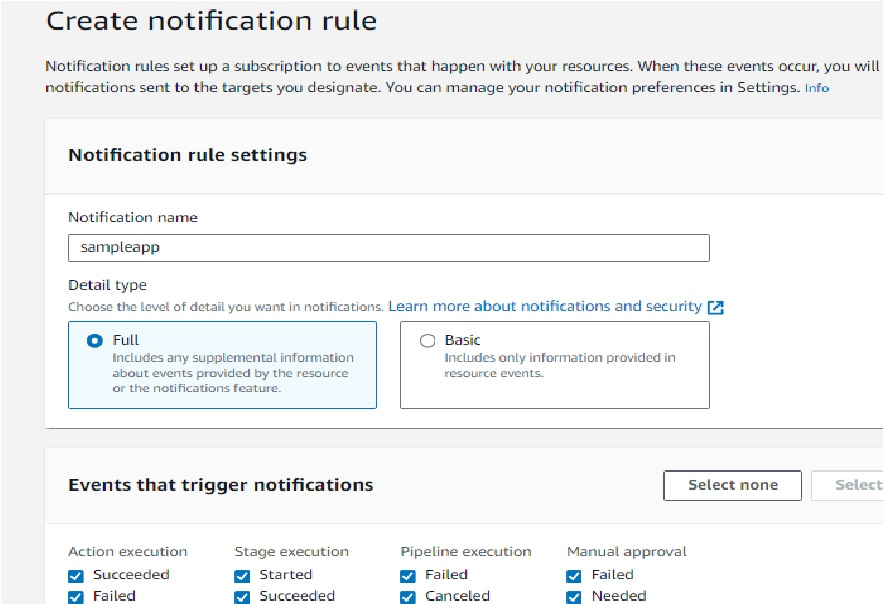

[Code Files](CODE.md)

## Create Deploy Application & Push the code to S3 bucket
1.Create **S3 bucket** for upload the codes .
>Note:
Enable Public Access and Bucket Versioning

2.Change directory to sampleapp developer machine and create a codedeploy application. Execute the command below


```cmd

# aws deploy create-application --application-name sampleapp

```


Now upload the code to S3 by the executing the command below. Directory of execution is important.


```cmd
# aws deploy push --application-name sampleapp --s3-location s3://nksampleapp/sampleapp.zip

```
>Note:
Need to run this command where **appspec.yml** is present.


Now browse to s3 bucket and check sampleapp.zip .


## Create Deployment Group to include webserver
1. Login to Codedeply AWS web console
2. Select sampleapp and click Create Deployment Group from Deployment Groups tab.
3. Enter the values like below and leave the other parameters default
   
>Enter a deployment group name: **sampleapp**
Choose a service role:  **CodeDeploy**
Deployment type: in-place
Environment configuration: choose Amazon EC2 instances
Key as **Name**  Value as **web**
Load balancer:  uncheck Enable load balancing

Click Create Deployment Group button to finish creation of deployment group


## Create Deployment, push code to the webserver

In the sampleapp click Create Deployment. Enter values like below. Other parameter can can be kept default

>Deployment group : **sampleapp**
Revision type: My application is stored in Amazon S3
Revision location : s3://nksampleapp/sampleapp.zip...

Click Create Deployment to finish

**Initial Deployment Will Start...**


##### Testing the Configuration
Ping Web server on browser using Public IP


## Implementing CodePipeline

1. Give Name and choose pipline type . 


2. Give **Source Provider** details .


3. Skip **Build Stage**.

4. Give **Deploy** Details .


5. After Creation, **Pipeline** will run automatically .


## Checking Pipeline  will trigger or not based on S3 object update

1. Delete existing **sampleapp.zip** in ec2 instance.
   
> rm -rf sampleapp.zip

2. Update **index.html** .


```html

<html>
<h2> Sample App Version 2.0 </h2>
</html>

```

3. Now **zip** and push to **S3** .

>zip -r ./sampleapp.zip .
aws s3 cp sampleapp.zip  s3://gir-sampleapp


4. Pipeline will trigger and Deployment starts .


##### check output :


## Enabling Notification Service :

>Create One SNS Topic for Pipeline Notification

1. Click pipeline->Notify->Create Notification Rule .


2. Give Notification Name,Choose Details Type and Events that trigger notifications,



Choose SNS Topic in Targets.


## SNS Notification
Update the code, Check Output and SNS Notificarion about Pipeline Process

#### E-Mail Notification:


