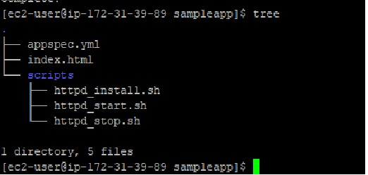

[Previous: Create EC2 instances and Configuring CodeDeploy Agent](EC2.md)


# Code Files

Create Following files in sampleapp folder.


```cmd

mkdir sampleapp
cd sampleapp
vi appspec.yml
```


appspec.yml  used to CodeDeploy

#### appspec.yml

```yml

version: 0.0
os: linux
files:
 - source: /index.html
   destination: /var/www/html/
hooks:
 BeforeInstall:
  - location: scripts/httpd_install.sh
    timeout: 300
    runas: root
  - location: scripts/httpd_start.sh
    timeout: 300
    runas: root
 ApplicationStop:
  - location: scripts/httpd_stop.sh
    timeout: 300
    runas: root

```


## Sample code for web page

```cmd

vi index.html

```

#### index.html

```html

<html>
<h2> Sample App Version 1.0 </h2>
</html>

```

Create Following 3 script file inside **/sampleapp/scripts/** folder

```cmd

mkdir scripts
cd scripts
vi httpd_install.sh

```

#### httpd_install.sh

```bash

#!/bin/bash
yum install -y httpd

```

#### httpd_start.sh

```cmd

vi httpd_install.sh
```

```bash

#!/bin/bash
systemctl start httpd
systemctl enable httpd

```


#### httpd_stop.sh

```cmd

vi httpd_stop.sh

```

```bash

#!/bin/bash
systemctl stop httpd
systemctl disable httpd

```
## Files Structure :



**Finally Zip it ....**

```cmd

zip -r ./sampleapp.zip .

```


[Next: Implementing CodeDeploy And CodePipeline](CDCP.md)
