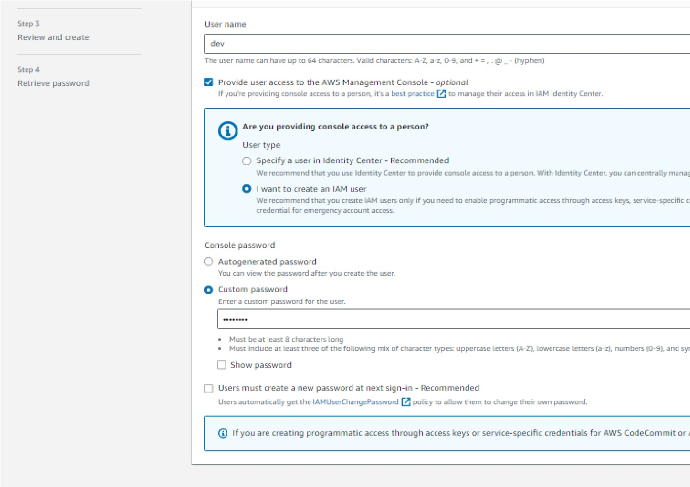
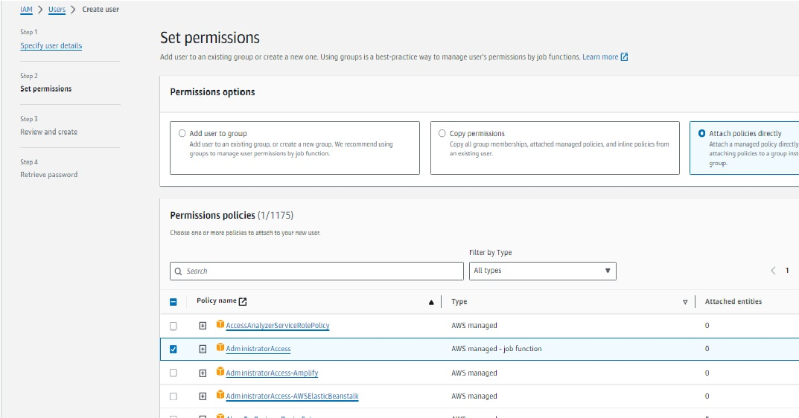
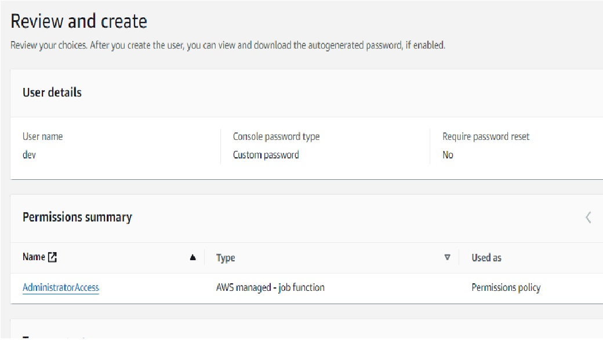
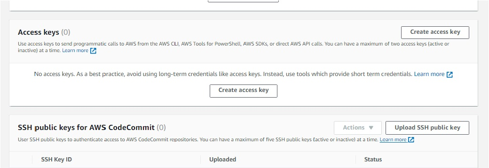
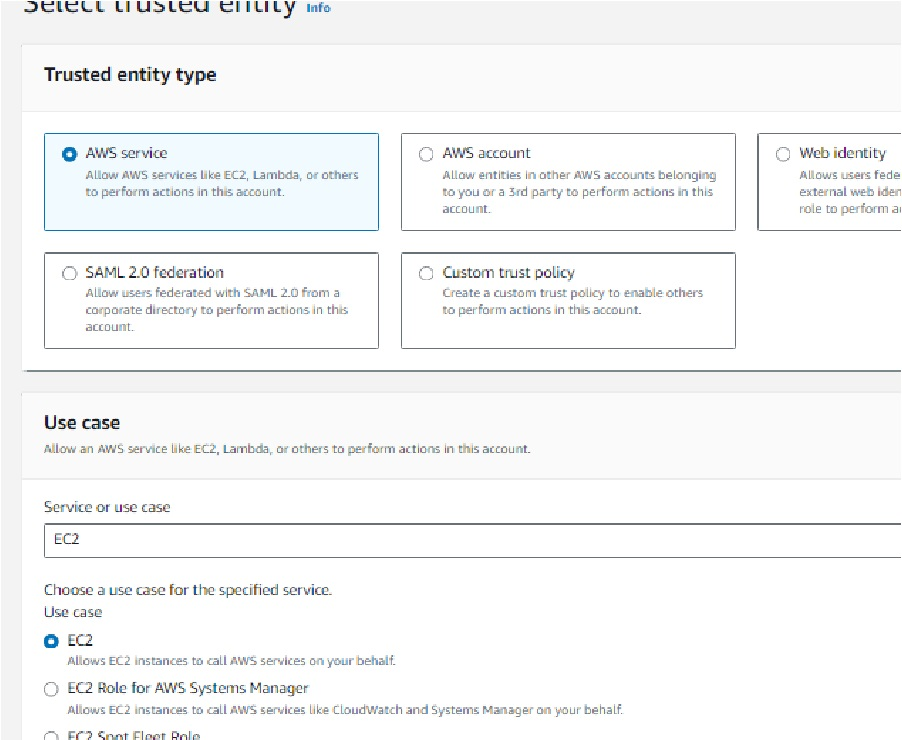
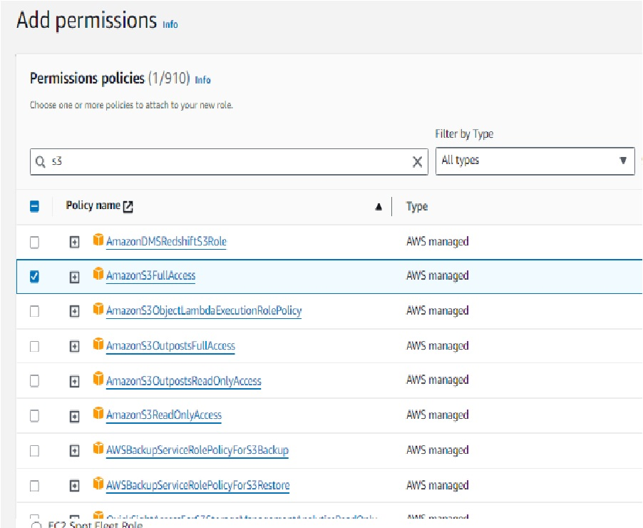
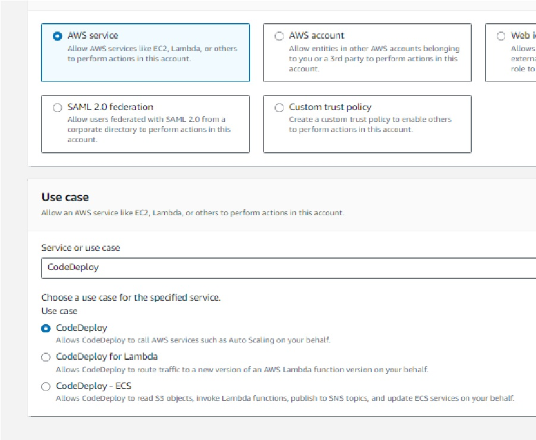
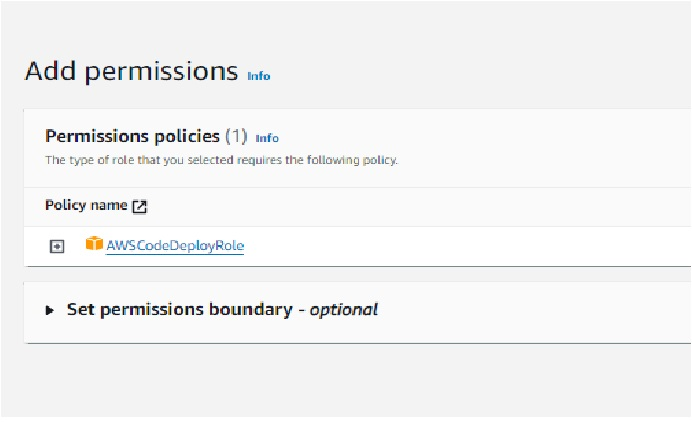

 [Previous: Introduction](Readme.md)

 
 ## Creating User with Admin Access
 1.Open IAM->Role->Create Role. 
 
> Note: Enable AWS Management Console access

2. Click Attach Policies and select **Administrator Access**

3. Review details and Click create. Download .CSV file on next page.

4. Click "dev" on user. Security Credentials->Access Keys. click **create access key** 
        1.Use Case : Command Line Interface (CLI)
        2.Download .CSV file

## Create Roles
#### 1.EC2-S3 Access:

1. Click **Create Role** in IAM.

2. Permission : **AmazonS3FullAccess**

3. Give Role Name as **EC2-S3** and Click **Create** .

#### 2.CodeDeploy Role:

1. Click **Create Role** in IAM.

2. Permission : **AWSCodeDeployRole**

3. Give Role Name as **CodeDeploy** and Click **Create** .
   

[Next: Create EC2 instances and Configuring CodeDeploy Agent](EC2.md)

