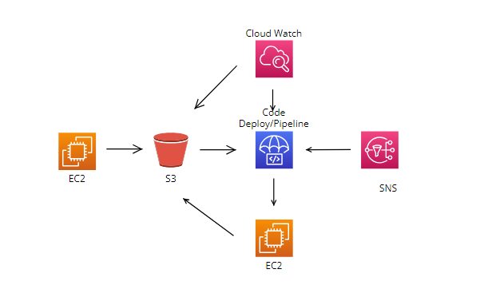

## AWS CICD Process

Implementing below Continuous CodeDeployment process using AWS IAM, EC2, S3, CodeDeploy, CodePipeline, CloudWatch and SNS.

#### Work Flow :
1. Pushing the code to **S3 bucket** from dev ec2.
2. S3 configured with **CodeDeploy** and **CodePipeline** for continuous deployment . 
3. CloudWatch Triggers the CodePipeline to deploy code whenever **S3 Object** updated. 
4. **SNS** configured with codepipeline for notification.

[Next: Create Roles and User](IAM.md)